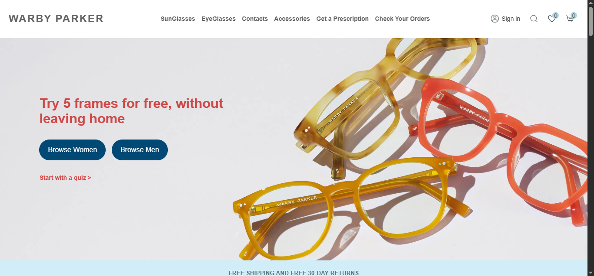
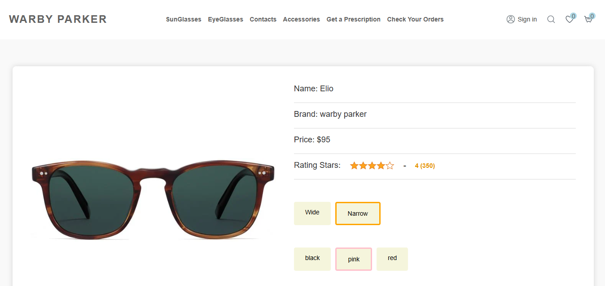
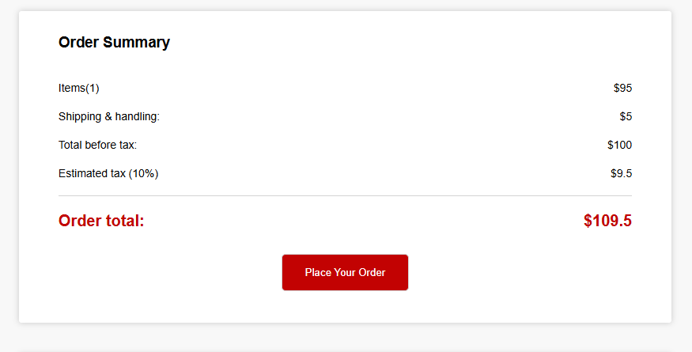

# Warby Parker Frontend Clone

An older 2024 frontend project built to recreate a large part of the Warby Parker browsing and shopping experience in plain HTML, CSS, and vanilla JavaScript. The app includes a homepage, product category pages, single-product views, search, favourites, cart and checkout flow, quiz-based recommendations, eye-exam booking, sign-in/register UI, and several supporting marketing and legal pages.

The project is fully multi-page rather than SPA-based, with reusable header/footer partials loaded across pages, product data coming from a local JSON file, and user state stored in `localStorage`. It is not a polished production codebase, but it does show a lot of hands-on work across UI building, page wiring, state persistence, and multi-step interactions.

## Features

- Reusable header and footer loaded into pages through JavaScript.
- Homepage with hero content, marketing sections, product previews, and a toggle between eyeglasses and sunglasses.
- Product rendering from `API/products.json` across the home page, category pages, favourites, quiz results, cart, and order history.
- Separate browsing pages for eyeglasses, sunglasses, accessories, and contacts.
- Product filter flow with options such as best selling, top searched, shape, size, color, gender, material, and price.
- Filtered category URLs that use query parameters to preserve product selections.
- Single-product page with size selection, color selection, quantity controls, related products, and add-to-cart support.
- Favourites system with icon toggling, saved state, and a dedicated favourites page.
- Search page with query-based filtering and a section for top searched products.
- Cart page with quantity editing, item removal, delivery option selection, and order total calculation.
- Checkout flow split across shipping details, payment, and order schedule pages.
- Payment page with credit card form handling and optional PayPal button rendering.
- Quiz flow that collects style preferences and recommends matching products.
- Eye exam booking flow with step-by-step answers, personal details form, calendar date selection, and confirmation output.
- Order history / order schedule page that reads saved orders and shows expandable details.
- Sign-in / register interface with password visibility toggle and mode switching.
- Multiple extra content pages such as `learnmore.html`, `getPrescription.html`, `virtual-vision-test.html`, `app.html`, `giftCard.html`, and legal/privacy pages.

## Tech

- HTML5 for the multi-page site structure.
- Vanilla JavaScript with ES module imports.
- CSS3 for page styling.
- `fetch()` for loading local JSON data and reusable HTML partials.
- `localStorage` for cart, favourites, quiz answers, checkout details, order history, and other page state.
- Font Awesome for icons.
- PayPal JavaScript SDK on the payment page.
- CSS layout techniques used in the project include Flexbox, CSS Grid, media queries, transitions, overlays, and responsive product-grid patterns.

## How to Run

1. Clone or download this repository.
2. Open the project in VS Code or any editor.
3. Run it with a local static server such as Live Server.
4. Start from `warbyparker.html`.

Note: the project uses `fetch()` to load JSON data and shared HTML components, so opening files directly with `file://` is not recommended.

## Live Demo

[GitHub Pages Demo](https://kinkriashvilirati.github.io/Warby-Parker/warbyparker.html)

## Demo Video

[Watch the demo](https://www.youtube.com/watch?v=52384VLMtRo)

## Screenshots

